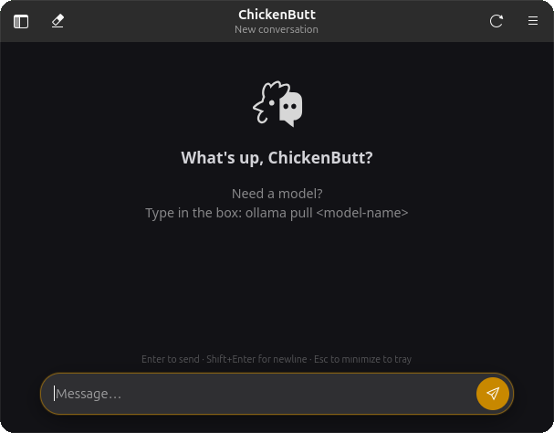
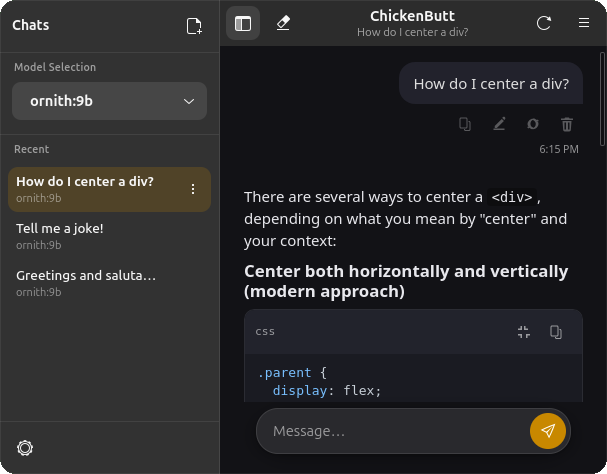
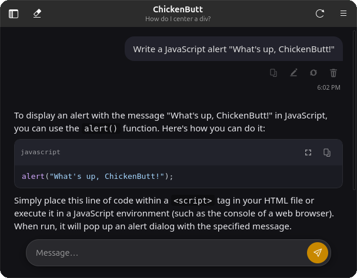

<p align="center">
  
</p>

<h1 align="center">ChickenButt</h1>

<p align="center">
  <strong>A chat client for your local AI.</strong><br>
  Named after a butt joke.<br>
  We're not sorry.
</p>

ChickenButt is a native Linux desktop app for chatting with local AI models through [Ollama](https://ollama.com).

**Website:** [https://www.chickenbutt.dev/](https://www.chickenbutt.dev/)  
**Source:** [https://github.com/pixelhackstudios/ChickenButt](https://github.com/pixelhackstudios/ChickenButt)  
**Releases:** [Download the latest release from GitHub Releases](https://github.com/pixelhackstudios/ChickenButt/releases/latest)

It is built with GTK4 and libadwaita, designed to feel at home on GNOME, and focused on making local AI pleasant to use without turning the interface into an aircraft cockpit.

<p align="center">
  
</p>

## What it does

* Chats with local Ollama models
* Streams responses as they are generated
* Keeps multiple conversations in a local SQLite database
* Renders Markdown, tables, links, and syntax-highlighted code
* Lets you copy, expand, and collapse code blocks
* Optional reasoning/thinking display for supported Ollama models (Show reasoning)
* Per-model settings for connection, context, and response preferences
* Model Fit diagnostics for how a model sits on your machine
* Shows clear health information when Ollama is unavailable
* Lists, inspects, and pulls models from the composer
* Exports conversations as Markdown or JSON
* Includes a native system tray integration
* Offers both WebKit and native GTK transcript renderers

<table align="center">
  <tr>
    <td></td>
    <td></td>
  </tr>
  <tr>
    <td align="center"><strong>Multiple conversations</strong></td>
    <td align="center"><strong>Readable code blocks</strong></td>
  </tr>
</table>

## Install ChickenButt

The easiest way to get ChickenButt is the Linux Flatpak from GitHub Releases.

1. Install [Ollama](https://ollama.com) on the host and make sure it is running (ChickenButt does not bundle Ollama or models).
2. Download the latest `.flatpak` from **[GitHub Releases](https://github.com/pixelhackstudios/ChickenButt/releases/latest)**.
3. Install and run:

```bash
flatpak install --user ./ChickenButt-*-x86_64.flatpak
flatpak run io.github.pixelhackstudios.ChickenButt
```

Requires `flatpak` and a host Ollama service. The Flatpak ships its own GTK/runtime stack against `org.gnome.Platform`.

### Running Ollama

ChickenButt does not bundle Ollama or any AI models.

Install Ollama using its official Linux documentation, then make sure it is running:

```bash
ollama serve
```

Check your installed models:

```bash
ollama list
```

ChickenButt will still open when Ollama is unavailable. It will show health and onboarding information instead of simply crashing.

## Build from source

### Development Flatpak

Build and install a development Flatpak from a checkout (does not require host GTK packages):

```bash
# once: flatpak + flatpak-builder + GNOME Platform/SDK 50 from Flathub
./scripts/build_flatpak.sh
flatpak run io.github.pixelhackstudios.ChickenButt
```

Details, inventory, and sandbox justifications:

* **[packaging/flatpak/README.md](packaging/flatpak/README.md)**
* **[packaging/flatpak/INVENTORY.md](packaging/flatpak/INVENTORY.md)**

Publishing to Flathub is a separate maintainer step and must follow current Flathub policy.

### Meson install (host packages)

ChickenButt uses Meson for a traditional host install. You will need Python 3.10+, GTK4, libadwaita, WebKitGTK 6.0, PyGObject, dasbus, and build tools.

See **[DEPENDENCIES.md](DEPENDENCIES.md)** for Fedora and Ubuntu package names.

```bash
python3 scripts/check_dependencies.py --build

meson setup build --prefix="$HOME/.local"
meson install -C build
```

Launch the installed app:

```bash
chickenbutt
```

Make sure `$HOME/.local/bin` is on your `PATH`. Rebuild with `meson setup --reconfigure build --prefix="$HOME/.local"` and `meson install -C build`. Uninstall with `ninja -C build uninstall` from the retained build directory.

## Development

### Run from the source tree

```bash
git clone https://github.com/pixelhackstudios/ChickenButt.git
cd ChickenButt
./run.sh
```

This runs the app directly from the checkout without installing anything.

Native GTK transcript instead of WebKit:

```bash
CHICKENBUTT_TRANSCRIPT=native ./run.sh
```

Check host dependencies without installing:

```bash
python3 scripts/check_dependencies.py
python3 scripts/check_dependencies.py --build
```

### Local data

ChickenButt keeps its application data on your machine.

| Data                 | Location                                      |
| -------------------- | --------------------------------------------- |
| Conversation history | `~/.local/share/chickenbutt/conversations.db` |
| Settings             | `~/.config/chickenbutt/settings.json`         |

Override the conversation database location with:

```bash
CHICKENBUTT_DB=/path/to/conversations.db ./run.sh
```

### Repository layout

```text
ChickenButt/
├── chickenbutt-web/   Project website source
├── data/              Desktop and AppStream metadata
├── icons/             Application icons
├── packaging/         Installed launcher script and Flatpak packaging
├── scripts/           Tests, checks, and development tools
├── vendor/            Vendored Python dependencies
├── web/               Embedded transcript interface
└── *.py               Desktop application source
```

The two web directories serve different purposes:

* `web/` is part of the desktop application and renders conversations inside WebKit.
* `chickenbutt-web/` is the public project website built with React and Vite.

### Website development

The project website lives in `chickenbutt-web/`.

```bash
cd chickenbutt-web
npm ci
npm run dev
```

Create a production build:

```bash
npm run build
```

Generated `node_modules/` and `dist/` directories are intentionally excluded from Git.

### Testing

ChickenButt includes tests covering conversation storage, streaming, cancellation, Markdown sanitization, navigation security, desktop integration, dependency declarations, and installed layouts.

Run individual checks from the repository root:

```bash
python3 scripts/smoke_gui.py
python3 scripts/test_multichat.py
python3 scripts/test_message_actions.py
python3 scripts/test_ollama_health.py
python3 scripts/test_generation_lifecycle.py
```

The authoritative automated test commands are maintained in:

```text
.github/workflows/tests.yml
```

For the website:

```bash
cd chickenbutt-web
npm run build
```

## Contributing

Bug reports, fixes, design improvements, and carefully scoped features are welcome.

Before making agent-assisted changes, read **[AGENTS.md](AGENTS.md)**. It defines the repository’s expectations around scope, verification, Git operations, and reporting.

Please keep changes focused and verify the behavior you touched.

## Project status

ChickenButt is under active development.

Versioned Linux Flatpak builds are published on [GitHub Releases](https://github.com/pixelhackstudios/ChickenButt/releases/latest). You can also run from source or build a development Flatpak. The public website lives in this repository. Flathub publication remains a separate maintainer step.

It is built primarily for GNOME-style Linux desktops, though other GTK-compatible environments may work.

## License

ChickenButt is licensed under the [GNU General Public License v3.0 or later](LICENSE).

Vendored third-party projects retain their original licenses:

* [mistune](vendor/mistune) — BSD-3-Clause
* [marked.js](web/vendor/marked.min.js) — MIT
* [DOMPurify](web/vendor/purify.min.js) — Apache-2.0 OR MPL-2.0
* [highlight.js](web/vendor/highlight.min.js) — BSD-3-Clause
