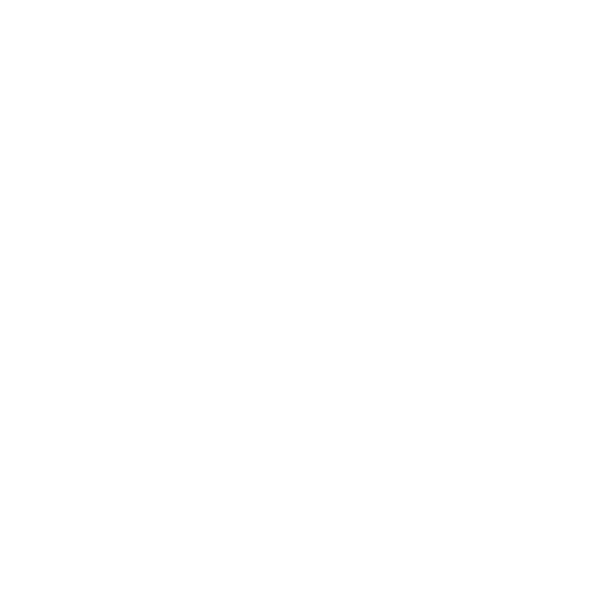

<p align="center">
  
</p>

<h1 align="center">ChickenButt Website</h1>

<p align="center">
  The official website for
  <a href="https://github.com/pixelhackstudios/ChickenButt"><strong>ChickenButt</strong></a>,
  a native Linux desktop client for chatting with local Ollama models.
</p>

<p align="center">
  Designed and built by <strong>Scott O'Nanski</strong> at
  <a href="https://www.pixelhackstudios.com"><strong>Pixel Hack Studios</strong></a>.
</p>

## About this directory

`chickenbutt-web/` contains the public website for the ChickenButt project.

It is part of the main ChickenButt repository rather than a separate standalone repository:

```text
ChickenButt/
├── chickenbutt-web/   Public React/Vite website
├── web/               Embedded desktop transcript interface
└── *.py               Native desktop application
```

The two web directories are unrelated:

* `chickenbutt-web/` is the public project website.
* `web/` is bundled with the desktop app and renders conversations inside WebKit.

Please do not merge or confuse them. That would be bad. Probably not catastrophic, but definitely annoying.

## What is ChickenButt?

ChickenButt is a native GTK4 and libadwaita desktop app for chatting with AI models running locally through [Ollama](https://ollama.com).

It is built for people who want a straightforward local chat client without accounts, cloud lock-in, tracking, or an interface containing six dashboards and seventeen settings panels.

The name was intentional.

## Website features

* Custom ChickenButt visual identity
* Responsive desktop and mobile layouts
* React 19 and Vite
* Tailwind CSS v4
* shadcn-based interface components
* Custom typography using Bungee and Geist
* Animated mascot and decorative elements
* Product screenshots and feature sections
* Installation and contribution information
* Built-in visual style guide

## Local development

Clone the main repository:

```bash
git clone https://github.com/pixelhackstudios/ChickenButt.git
cd ChickenButt/chickenbutt-web
```

Install the exact dependency versions from the lockfile:

```bash
npm ci
```

Start the development server:

```bash
npm run dev
```

Vite will print the local development address, normally:

```text
http://localhost:5173/
```

## Production build

Create a production build:

```bash
npm run build
```

The generated website is written to:

```text
dist/
```

Both `dist/` and `node_modules/` are generated locally and are intentionally excluded from Git.

## Project structure

```text
chickenbutt-web/
├── .agents/           Agent instructions and development skills
├── public/            Logos, mascot artwork, screenshots, and doodles
├── src/
│   ├── components/    Page sections and interface components
│   ├── lib/           Shared utilities
│   ├── App.jsx        Main website composition
│   ├── index.css      Website styles and design tokens
│   └── main.jsx       React entry point
├── index.html
├── package.json
└── vite.config.js
```

## Agent-assisted development

This directory includes its own agent instructions and skills:

```text
AGENTS.md
.agents/skills/
```

Agents working on the website should read those instructions before making changes.

The root repository also contains an `AGENTS.md` file covering rules shared across the desktop app and website.

## Related links

* [ChickenButt repository](https://github.com/pixelhackstudios/ChickenButt)
* [Website source](https://github.com/pixelhackstudios/ChickenButt/tree/main/chickenbutt-web)
* [Pixel Hack Studios](https://www.pixelhackstudios.com)
* [Scott O'Nanski on GitHub](https://github.com/scottonanski)
* Contact: `whatsup@chickenbutt.dev`

## License

ChickenButt is licensed under the GNU General Public License v3.0 or later.

Free software. Local AI. Butt joke.
